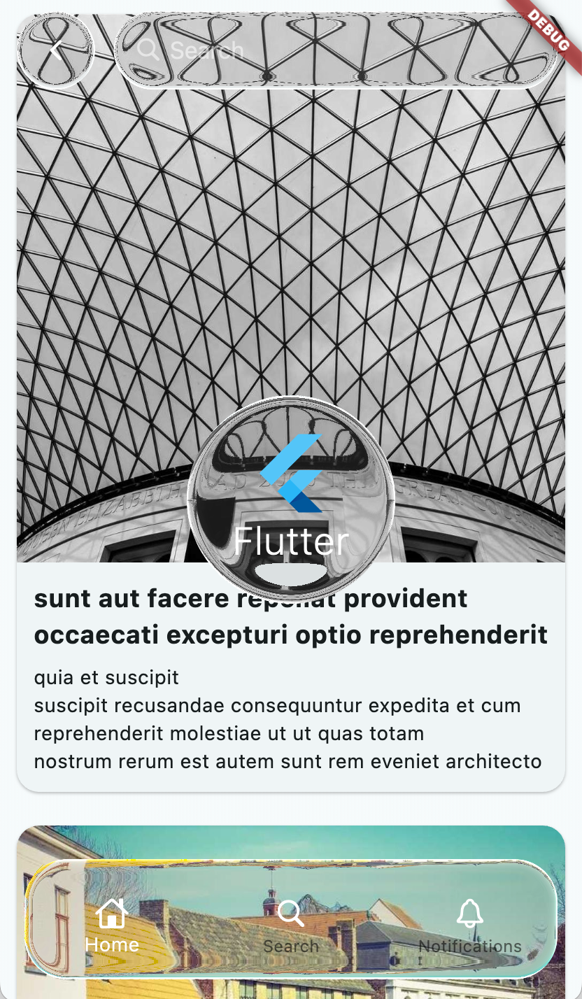
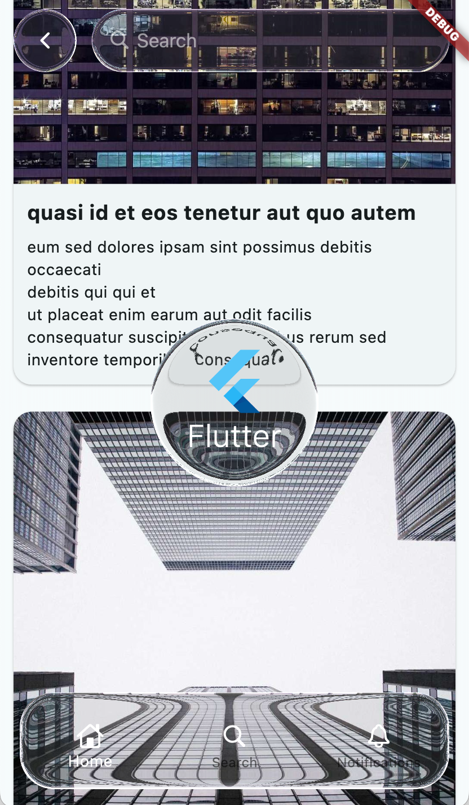

# 🧊 liquid_glass_flutter

**liquid_glass_flutter** is a Flutter package that brings beautiful, animated **liquid glass distortion** effects to any widget using a custom GLSL fragment shader. Perfect for glassmorphism, water ripple overlays, and creative UI filters.

---

## 🔮 Preview


---

## 🖼️ Screenshots

| Example 1                            | Example 2                            |
|-------------------------------------|-------------------------------------|
|         |         |

---

---

## ✨ Features

- 🌊 Realistic animated liquid distortion
- 🧩 Works with any widget using child composition
- 🎯 Precise shader masking based on widget position and size
- 🌀 Customizable blur and border radius
- 🎥 Smooth real-time animation using Flutter's Ticker

---

## 🧱 Installation

Add this to your `pubspec.yaml`:

```yaml
dependencies:
  liquid_glass_flutter: ^0.1.0
```

Then run:

```bash
flutter pub get
```

---

## 🧪 Example

```dart
import 'package:flutter/material.dart';
import 'package:liquid_glass_flutter/liquid_glass_flutter.dart';

class DemoPage extends StatelessWidget {
  @override
  Widget build(BuildContext context) {
    return Scaffold(
      backgroundColor: Colors.blueGrey[900],
      body: Center(
        child: LiquidGlass(
          borderRadius: 24,
          blur: 8,
          child: Container(
            width: 300,
            height: 200,
            color: Colors.white.withOpacity(0.1),
            alignment: Alignment.center,
            child: Text(
              'Liquid Glass',
              style: TextStyle(fontSize: 24, color: Colors.white),
            ),
          ),
        ),
      ),
    );
  }
}
```

---

## 🧠 How It Works

The `LiquidGlass` widget:

- Loads a GLSL shader (`liquid_glass.frag`) from assets
- Tracks the widget’s position and size on screen
- Passes uniforms like `uResolution`, `uTime`, `uCenter`, `uBlur`, and `uBorderRadius` to the shader
- Applies the result using `ImageFilter.shader()` via `BackdropFilter`

---

## 📁 Asset Setup

Ensure your `pubspec.yaml` includes the shader asset:

```yaml
flutter:
  assets:
    - assets/shaders/liquid_glass.frag
```

If you're using this from a **package**, prefix with the package name when loading:

```dart
FragmentProgram.fromAsset(
  'packages/liquid_glass_flutter/assets/shaders/liquid_glass.frag'
);
```

---

## 📄 API

```dart
LiquidGlass({
  required Widget child,
  double borderRadius = 16,
  double blur = 0.0,
})
```

| Property      | Type    | Description                                  |
|---------------|---------|----------------------------------------------|
| `child`       | Widget  | The widget to apply the glass effect to      |
| `borderRadius`| double  | Corner radius for the clipping mask          |
| `blur`        | double  | Placeholder for custom blur (not yet wired)  |

---

## 🎯 To Do

- [ ] Enable interactive ripples with gesture input
- [ ] Expose shader uniforms like noise strength, stretch, etc.
- [ ] Add support for different shapes (circles, paths)
- [ ] Bundle prebuilt shader variations

## 🧩 License

MIT License © 2025  
Developed with 💙 for creative UI builders.

---

## 👋 Contributions Welcome

Have an idea or improvement? Feel free to open an issue or PR!
